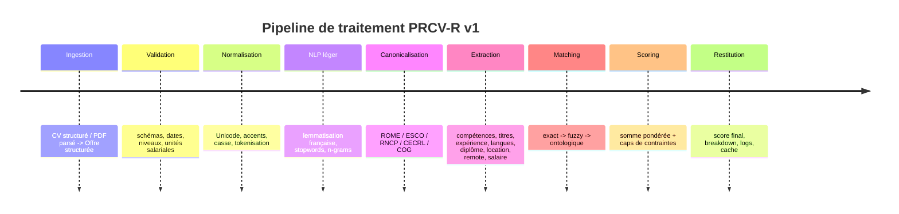
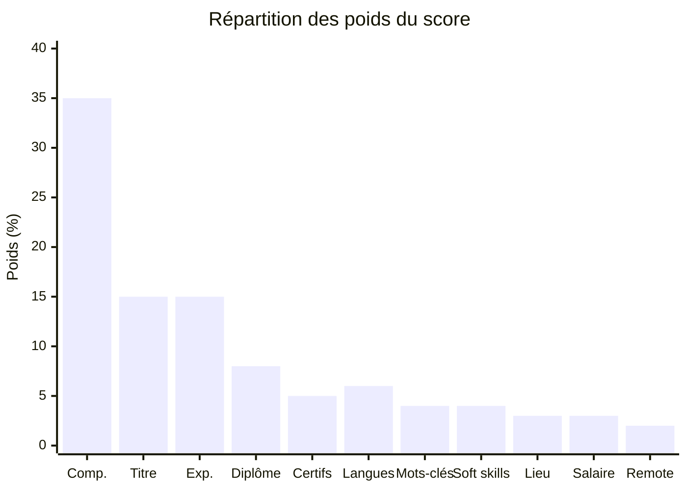

# Protocole déterministe de scoring CV–offres pour une application Next.js

## Synthèse exécutive

Le protocole recommandé est un **scoring déterministe, explicable et non génératif** qui compare un CV structuré à chaque offre structurée au moyen d’un **référentiel métier/compétences** et d’une **formule de score composite unique**. Le noyau du dispositif s’appuie prioritairement sur le référentiel ROME 4.0 de entity["organization","France Travail","emploi, france"], complété par ESCO pour les relations sémantiques contrôlées entre professions et compétences, par Europass pour la structure des CV, par le RNCP de entity["organization","France compétences","certification, france"] pour les niveaux de qualification, par le CECRL pour les langues, par le COG de entity["organization","Insee","statistiques, france"] pour les lieux, et par les règles de minimisation et de non-discrimination de la entity["organization","CNIL","protection donnees, france"]. ROME 4.0 a précisément été refondu pour renforcer l’approche par compétences et le rapprochement entre offres et candidats ; ESCO fournit un vocabulaire multilingue structuré des professions et aptitudes ; Europass structure les rubriques de profil ; le RNCP et le cadre national de certification normalisent les niveaux de diplôme ; le CECRL normalise les niveaux de langue. citeturn25view0turn26view0turn30view0turn30view1turn41view0turn27view1turn29view4turn29view2

La recommandation opérationnelle est la suivante : **pas d’IA générative, pas de LLM, pas de prompt**, et **pas d’embeddings dans la version de base**. Le matching sémantique doit être assuré par des **thésaurus/ontologies curés** et par des règles de similarité auditables. Cette orientation est cohérente avec la littérature sur les approches hybrides ontologiques pour le recrutement, qui combinent raisonnement sémantique et similarité pour classer les candidats, ainsi qu’avec les approches pondérées par champs qui comparent séparément compétences, titres, expérience et formation. Elle est aussi plus compatible avec les exigences de traçabilité, de minimisation et d’explicabilité rappelées par la CNIL pour les traitements de recrutement et les logiciels de tri/classement. citeturn35view1turn35view2turn32view0turn32view1turn39view1

Le score final proposé est une **somme pondérée sur 100 points** : compétences 35, intitulé métier 15, expérience 15, diplôme 8, certifications 5, langues 6, mots-clés 4, soft skills 4, localisation 3, salaire 3, télétravail 2. Des **caps déterministes** s’appliquent ensuite aux cas critiques : absence d’exigence légale obligatoire, trop faible couverture des compétences indispensables, ou non-satisfaction de langue/certification explicitement requise. L’ensemble fournit un score comparable d’une offre à l’autre, tout en conservant un **détail par sous-score** pour que l’utilisateur comprenne pourquoi une offre est bien ou mal classée. Cette logique reprend l’idée, fréquente dans la recherche, d’une similarité par champs pondérés et d’un classement final par pertinence plutôt qu’un simple filtrage par mots-clés. citeturn35view0turn35view2turn25view0

## Cadrage des sources et principes du protocole

Le protocole retenu est : **PRCV-R v1** — *Protocole de Relevance Scoring CV–Offre fondé sur ROME*. Son principe central est que la **compétence canonisée** est l’unité primaire de comparaison, avant le mot-clé libre. Ce choix est justifié par la structure même de ROME 4.0, qui formalise domaines, enjeux, objectifs, macro-compétences, savoir-faire, savoirs et contextes de travail, et par son objectif explicite d’améliorer l’ajustement entre besoins en recrutement, compétences disponibles et besoins de formation. En complément, ESCO joue le rôle de **thésaurus sémantique contrôlé** pour relier professions, aptitudes/compétences, connaissances et termes secondaires multilingues. ONISEP, via ses fiches métiers et ses secteurs, sert surtout à enrichir faiblement l’alignement *métier ↔ formation ↔ secteur* plutôt qu’à porter le score principal. citeturn25view0turn26view0turn30view0turn30view1turn27view0

Le protocole distingue strictement **données utiles au recrutement** et **données exclues du scoring**. La CNIL rappelle qu’un recruteur ne doit traiter que des informations présentant un lien direct et nécessaire avec l’emploi proposé ou l’évaluation des aptitudes professionnelles, et alerte explicitement contre la collecte ou l’usage de données excessives ou discriminantes. En conséquence, **nom, prénom, email, téléphone, photo, âge/date de naissance, lieu de naissance, nationalité détaillée, situation familiale, adresse exacte** n’entrent **jamais** dans la fonction de score. Si ces données existent pour le workflow métier, elles doivent rester hors du module de ranking et, pour les jeux d’évaluation, être pseudonymisées ou supprimées. citeturn32view0turn32view1turn32view2turn43view0

Le protocole est **unique** au sens où il n’y a **qu’une seule formule de score** et **qu’un seul pipeline**. Les paramètres restent ajustables par configuration, mais pas la logique. La clause « embeddings seulement s’ils sont pré-calculés et hors ligne » est tranchée ici ainsi : **désactivés en v1**. ESCO propose bien une API locale téléchargeable et le modèle français `fr_core_news_md` de spaCy embarque bien des vecteurs ; cependant, pour garder un système purement auditable, reproductible et léger en production Next.js, la version conseillée repose exclusivement sur taxonomies, lexiques, règles et similarités explicites. citeturn30view2turn34view2

## Formats d’entrée

Les formats ci-dessous sont conçus pour couvrir ce que les sources officielles exposent réellement. Côté offre, France Travail affiche et/ou collecte l’intitulé du poste, le lieu de travail, la nature du contrat, la durée de travail, la date de publication, le descriptif du poste, le profil recherché, l’expérience, jusqu’à deux formations, des compétences, des langues, des savoir-être professionnels, ainsi que le salaire et diverses conditions de travail. Côté CV, Europass structure le profil autour de l’éducation/formation, de l’expérience professionnelle, des compétences linguistiques et des compétences numériques ; le RNCP et le cadre national de certification permettent d’exprimer les niveaux de qualification ; le CECRL normalise les niveaux de langue. citeturn33search0turn42view0turn41view0turn27view1turn29view3turn29view2

### Schéma recommandé pour le CV

| Champ | Type | Obligatoire | Exemple | Utilisation dans le score |
|---|---|---:|---|---|
| `candidateId` | `string` | oui | `"cv_001"` | identifiant technique seulement |
| `headline` | `string` | oui | `"Développeuse full-stack TypeScript/Next.js"` | oui |
| `identity` | `object` | non | `{ name, email, phone }` | **non** |
| `location` | `object` | oui | `{ city:"Paris", postalCode:"75011", inseeCode:"75056", remotePreference:"hybrid", maxCommuteKm:45 }` | oui, version minimisée |
| `targetSalary` | `object` | non | `{ minAnnualGrossEur:50000, maxAnnualGrossEur:58000 }` | oui |
| `titles` | `array` | oui | `[{ raw:"Développeuse full-stack", canonicalRomeCode:"M1805" }]` | oui |
| `experiences` | `array` | oui | dates, titre, résumé, compétences observées | oui |
| `skills` | `array` | oui | `[{ raw:"TypeScript", canonicalSkillId:"rome:typescript", level:"advanced" }]` | oui |
| `education` | `array` | oui | `[{ degreeLabel:"Master informatique", rncpLevel:7, field:"informatique" }]` | oui |
| `certifications` | `array` | non | `[{ label:"AWS Cloud Practitioner", expiryDate:null }]` | oui |
| `languages` | `array` | non | `[{ code:"fr", cecrl:"C2" }, { code:"en", cecrl:"B2" }]` | oui |
| `softSkills` | `array` | non | `["travail en équipe","rigueur","autonomie"]` | oui, faible poids |
| `keywords` | `array` | non | `["SaaS","API","tests","agile"]` | oui, faible poids |
| `availabilityDate` | `string` ISO | non | `"2026-06-01"` | optionnel |
| `desiredContracts` | `array` | non | `["CDI","Télétravail partiel"]` | oui, faible poids |

### Schéma recommandé pour l’offre

| Champ | Type | Obligatoire | Exemple | Utilisation dans le score |
|---|---|---:|---|---|
| `offerId` | `string` | oui | `"ft_206WCDB"` | identifiant |
| `source` | `string` | oui | `"france_travail"` | traçabilité |
| `publishedAt` | `string` ISO | oui | `"2026-04-14"` | tie-break |
| `title` | `string` | oui | `"Développeur Full Stack Next.js / Node.js"` | oui |
| `description` | `string` | oui | résumé + missions + profil | oui |
| `company` | `object` | non | `{ name:"Acme" }` | non, sauf secteur faible poids |
| `location` | `object` | oui | `{ city:"Paris", postalCode:"75002", inseeCode:"75056" }` | oui |
| `remoteMode` | `enum` | oui | `"hybrid"` / `"onsite"` / `"remote"` | oui |
| `contract` | `object` | oui | `{ type:"CDI", weeklyHours:39 }` | optionnel |
| `salary` | `object` | non | `{ minAnnualGrossEur:50000, maxAnnualGrossEur:58000 }` | oui |
| `jobTarget` | `object` | oui | `{ rawTitle, canonicalRomeCode, escoOccupationId }` | oui |
| `skills` | `array` | oui | `[{ raw:"Next.js", canonicalSkillId:"...", importance:"must" }]` | oui |
| `experienceRequirement` | `object` | non | `{ minYears:4 }` | oui |
| `educationRequirements` | `array` | non | RNCP, domaine, obligatoire ou non | oui |
| `certificationRequirements` | `array` | non | labels/codes, mandatory/optional | oui |
| `languageRequirements` | `array` | non | `[{ code:"en", minCecrl:"B2", mandatory:true }]` | oui |
| `softSkills` | `array` | non | savoir-être demandés | oui, faible poids |
| `keywords` | `array` | non | `["API","tests","SaaS"]` | oui, faible poids |
| `legalRequirements` | `array` | non | permis, habilitation, droit au travail | bloqueurs éventuels |

Dans le modèle de production, je recommande de stocker les données de contact et d’identité dans un objet séparé, non transmis à `scoreOfferAgainstCv()`. C’est cohérent avec le principe de minimisation de la CNIL et avec le fait que, dans le recrutement, seules les informations adéquates, pertinentes et strictement nécessaires à l’appréciation des aptitudes doivent être collectées et utilisées. citeturn32view0turn32view1turn39view1

```json
{
  "candidateId": "cv_001",
  "headline": "Développeuse full-stack TypeScript/Next.js",
  "location": {
    "city": "Paris",
    "postalCode": "75011",
    "inseeCode": "75056",
    "remotePreference": "hybrid",
    "maxCommuteKm": 45
  },
  "targetSalary": { "minAnnualGrossEur": 50000, "maxAnnualGrossEur": 58000 },
  "titles": [{ "raw": "Développeuse full-stack", "canonicalRomeCode": "M1805" }],
  "skills": [
    { "raw": "TypeScript" },
    { "raw": "React" },
    { "raw": "Next.js" },
    { "raw": "Node.js" },
    { "raw": "PostgreSQL" },
    { "raw": "Docker" },
    { "raw": "Jest" },
    { "raw": "Cypress" }
  ],
  "education": [{ "degreeLabel": "Master informatique", "rncpLevel": 7, "field": "informatique" }],
  "certifications": [{ "label": "AWS Cloud Practitioner" }],
  "languages": [{ "code": "fr", "cecrl": "C2" }, { "code": "en", "cecrl": "B2" }],
  "softSkills": ["travail en équipe", "rigueur", "autonomie"],
  "keywords": ["SaaS", "API", "tests", "agile"]
}
```

```json
{
  "offerId": "offer_001",
  "source": "france_travail",
  "publishedAt": "2026-04-20",
  "title": "Développeur Full Stack Next.js / Node.js",
  "description": "CDI, Paris hybride, API SaaS, tests, PostgreSQL, Docker.",
  "location": { "city": "Paris", "postalCode": "75002", "inseeCode": "75056" },
  "remoteMode": "hybrid",
  "contract": { "type": "CDI", "weeklyHours": 39 },
  "salary": { "minAnnualGrossEur": 50000, "maxAnnualGrossEur": 58000 },
  "jobTarget": { "rawTitle": "Développeur Full Stack", "canonicalRomeCode": "M1805" },
  "skills": [
    { "raw": "TypeScript", "importance": "must" },
    { "raw": "Next.js", "importance": "must" },
    { "raw": "Node.js", "importance": "must" },
    { "raw": "React", "importance": "should" },
    { "raw": "PostgreSQL", "importance": "should" },
    { "raw": "Docker", "importance": "should" }
  ],
  "experienceRequirement": { "minYears": 4 },
  "educationRequirements": [{ "minRncpLevel": 6, "field": "informatique", "mandatory": false }],
  "languageRequirements": [{ "code": "en", "minCecrl": "B2", "mandatory": true }],
  "keywords": ["SaaS", "API", "tests"],
  "softSkills": ["rigueur", "travail en équipe"]
}
```

## Normalisation et prétraitement

Le pipeline doit transformer tout document entrant en un **artefact canonique, stable et versionné** avant le scoring. Les standards de lieu, de diplôme et de langue existent déjà : COG pour les codes géographiques, cadre national/RNCP pour les niveaux de qualification et CECRL pour les langues. Pour la langue française, la lemmatisation doit être privilégiée au stemming comme forme canonique, parce qu’elle produit une forme plus stable et mieux interprétable ; un stemmer français de type Snowball n’est utile qu’en rappel secondaire, jamais comme représentation métier de référence. Dans spaCy, la lemmatisation peut être gérée par un composant dédié, lookup ou rule-based ; Snowball prend explicitement en charge le français. citeturn29view0turn29view1turn29view3turn29view4turn29view2turn34view1turn16search2

Je recommande les règles suivantes, dans cet ordre :

| Étape | Règle retenue | Sortie |
|---|---|---|
| Validation | rejet des dates incohérentes, niveaux de langue inconnus, salaires négatifs | document valide |
| Unicode | NFC, trim, espaces multiples réduits | texte stable |
| Casse | minuscules pour index ; conservation de l’original pour affichage | double représentation |
| Accents | comparaison accent-insensible **dans l’index seulement** ; affichage avec accents | meilleur rappel sans perte UX |
| Tokenisation | regex métier qui **préserve** `c++`, `c#`, `.net`, `node.js`, `next.js`, `ci/cd`, `3d` | tokens pertinents |
| Stopwords | base française + stopwords RH de bruit (`poste`, `mission`, `profil`, `entreprise`, `candidat`) | vocabulaire utile |
| Lemmatisation | lexique offline ou lemmatiseur français offline | lemmas |
| Stemming | secours sur les mots non lemmatisés, uniquement pour recherche secondaire | stems de rappel |
| Dates | conversion ISO, fusion des intervalles qui se chevauchent | chronologie nettoyée |
| Lieux | ville/code postal → code COG + coordonnées centroïdes | lieu canonique |
| Salaires | horaire/mensuel/annuel brut → `annualGrossEur` | salaire comparable |
| Langues | `A1 < A2 < B1 < B2 < C1 < C2` | échelle ordinale |
| Diplômes | label → `rncpLevel` + domaine d’études | niveau comparable |

Pour les **synonymes de compétences**, la stratégie doit être strictement curée. Chaque entrée du dictionnaire doit contenir : un identifiant canonique, un libellé préféré, des variantes lexicales, des abréviations, des termes secondaires ESCO et, si possible, un rattachement à une macro-compétence ROME. ESCO est précieux ici parce que chaque concept de compétence comporte un terme recommandé, des termes secondaires et une description ; ROME est précieux parce qu’il structure les compétences par domaines, objectifs, macro-compétences, savoir-faire et savoirs, y compris un domaine spécifique de savoir-être professionnels. En revanche, un alias ambigu ne doit **pas** être auto-résolu sans contexte : `PO`, `Go`, `Lead`, `Angular` ou `R` exigent des règles métier ou de cooccurrence. citeturn30view1turn25view0

Les **années d’expérience** ne doivent pas être calculées en additionnant naïvement toutes les périodes. Il faut fusionner les intervalles qui se chevauchent, puis projeter l’expérience sur des familles pertinentes : *années pertinentes pour le titre*, *années pertinentes pour la compétence*, *années totales*. Ainsi, une mission freelance et un CDI concomitants ne doublent pas artificiellement les années. Pour les lieux, la comparaison doit se faire à granularité raisonnable — commune, département, région, distance au centroïde — plutôt qu’à l’adresse complète, pour rester conforme à la minimisation des données. citeturn29view0turn29view1turn32view1



## Extraction des caractéristiques et algorithmes de matching

La littérature utile pour ce besoin converge vers des approches **à champs séparés** et **hybrides** : on modélise d’un côté le candidat, de l’autre l’offre, puis on compare compétences, titres, expérience et formation avec des fonctions adaptées à chaque champ ; les approches ontologiques ajoutent un raisonnement sémantique au simple matching lexical. C’est exactement le bon compromis pour une application métier française qui doit rester auditée et maintenable. citeturn35view1turn35view2turn35view0

Le protocole extrait onze familles de signaux :

| Famille | Extraction | Similarité retenue |
|---|---|---|
| Compétences | liste canonisée + importance `must/should/nice` + date d’usage | exact, fuzzy, ontologique |
| Intitulé métier | titre brut + code ROME + occupation ESCO si connue | code exact, famille métier, Jaro-Winkler |
| Expérience | années pertinentes globales et par famille de compétences | ratio par rapport au minimum |
| Diplôme | niveau RNCP + domaine | niveau + proximité de domaine |
| Certifications | labels/codes, dates d’expiration | exact, valide/non valide |
| Langues | code langue + niveau CECRL | ordre CECRL |
| Mots-clés | n-grams métiers hors taxonomie | Jaccard / BM25-like léger |
| Soft skills | savoir-être ROME + dictionnaire interne | exact, famille ROME |
| Localisation | COG + distance + région | seuils de distance |
| Salaire | annualisation brut EUR | recouvrement d’intervalle |
| Télétravail | onsite/hybrid/remote + tolérance candidat | grille déterministe |

### Matching exact

Le matching exact est appliqué **après canonicalisation**, pas sur le texte brut. `react js`, `react.js`, `reactjs` et `react` doivent converger vers le même identifiant ; de même pour un titre déjà rattaché à un code ROME. Cette étape doit être privilégiée car elle est la plus stable, explicite et défendable. ROME expose justement les appellations, les compétences mobilisées et les certifications requises ; ESCO expose les professions et aptitudes sous forme de concepts reliés. citeturn26view0turn30view0turn30view1

### Matching flou

Le matching flou n’intervient **qu’après échec du matching exact** et **sur des chaînes déjà nettoyées**. Pour les **titres courts** et appellations métiers, j’utilise **Jaro-Winkler**, car cette famille est réputée particulièrement adaptée aux chaînes courtes ; pour les **libellés plus longs**, j’utilise une combinaison déterministe de **trigrammes** et de **chevauchement de tokens**, éventuellement appuyée par une distance d’édition normalisée sur un petit ensemble de candidats. PostgreSQL documente explicitement l’efficacité du trigramme pour mesurer la similarité de mots dans de nombreuses langues naturelles et pour accélérer la recherche de chaînes similaires. citeturn15search1turn40view0turn40view1

Seuils proposés, **ajustables mais gelés en production** :

- **Titres / appellations métiers**
  - `>= 0.95` : match fort, valeur `0.90`
  - `0.88–0.95` : match acceptable, valeur `0.75`
  - `< 0.88` : pas de match
- **Compétences / certifications textuelles**
  - `>= 0.92` : match fort, valeur `0.85`
  - `0.84–0.92` : match prudent, valeur `0.70`
  - `< 0.84` : pas de match

Ces valeurs sont des **paramètres de protocole**, pas des vérités universelles ; elles doivent être fixées une fois après validation sur un jeu de vérité terrain.

### Matching sémantique contrôlé

Le matching sémantique repose exclusivement sur un graphe de relations **curé** :

- même identifiant canonique ROME/ESCO : `1.00`
- terme secondaire ESCO ou variante connue du dictionnaire local : `0.95`
- parent/enfant direct dans ESCO ou même macro-compétence ROME : `0.80`
- même domaine ONISEP ou domaine de formation voisin : `0.35` **maximum** et seulement en appoint
- aucun lien taxonomique : `0.00`

Le point important est que **les relations sémantiques n’ont pas le droit de “fabriquer” une compétence absente**. Elles servent à reconnaître qu’`API REST` et `développement d’API` sont voisins, pas à assimiler `Data Engineer` et `Développeur Front`. Ce principe est cohérent avec les approches ontologiques hybrides de matching sémantique en recrutement. citeturn35view1turn30view1turn27view0

### Clause embeddings

La clause de votre cahier des charges est appliquée ainsi : **embeddings interdits dans le protocole v1**. Si, plus tard, une organisation veut tester une couche vectorielle, elle devra utiliser des vecteurs **pré-calculés hors ligne**, **stockés localement**, **sans appel réseau au moment du score**, et **avec un poids démarrant à 0** tant qu’une évaluation séparée ne démontre pas un gain réel sans perte d’explicabilité. ESCO fournit une API locale téléchargeable ; spaCy propose des vecteurs français embarqués dans `fr_core_news_md` ; mais je recommande de ne pas les mobiliser dans la première version opérationnelle. citeturn30view2turn34view2

## Formule de score composite et règles de décision

La formule unique recommandée est :

\[
\text{score\_brut}(cv, offre)=100\times\sum_{i=1}^{11} w_i \cdot s_i
\]

avec \(s_i \in [0,1]\) et \(\sum w_i = 1\).

Les poids par défaut sont :

- \(w_{\text{compétences}} = 0.35\)
- \(w_{\text{intitulé}} = 0.15\)
- \(w_{\text{expérience}} = 0.15\)
- \(w_{\text{diplôme}} = 0.08\)
- \(w_{\text{certifications}} = 0.05\)
- \(w_{\text{langues}} = 0.06\)
- \(w_{\text{mots\_clés}} = 0.04\)
- \(w_{\text{soft\_skills}} = 0.04\)
- \(w_{\text{localisation}} = 0.03\)
- \(w_{\text{salaire}} = 0.03\)
- \(w_{\text{remote}} = 0.02\)

Cette pondération est cohérente avec un marché français de l’emploi de plus en plus structuré par les compétences — objectif explicite de ROME 4.0 — et avec les systèmes académiques de matching CV–offre qui calculent une similarité par champs pondérés, notamment compétences, expérience et formation. Les critères de confort ou de préférence, comme le salaire, la localisation ou le télétravail, doivent compter, mais beaucoup moins que les signaux de qualification réelle. citeturn25view0turn35view2turn35view0

### Définition des sous-scores

\[
s_{\text{compétences}}=\frac{\sum_{k \in \text{skills offre}} \text{importance}(k)\times \text{match}(k)}{\sum_{k \in \text{skills offre}} \text{importance}(k)}
\]

avec `importance(must)=1.0`, `importance(should)=0.7`, `importance(nice)=0.4`.

\[
s_{\text{expérience}}=\min\left(1,\frac{\text{années pertinentes CV}}{\text{années min offre}}\right)
\]

\[
s_{\text{intitulé}}=
\begin{cases}
1.0 & \text{si code ROME identique}\\
0.85 & \text{si même famille métier}\\
\text{similarité floue contrôlée} & \text{sinon}
\end{cases}
\]

Pour le diplôme, j’utilise une combinaison `0.7 * niveau + 0.3 * domaine`. Pour les langues, un niveau CECRL au moins égal à l’exigence vaut `1.0`, un niveau inférieur d’un cran vaut `0.6`, au-delà `0.0`. Pour le salaire, j’utilise le recouvrement d’intervalles ; si l’offre ne publie aucun salaire, j’attribue un **neutre prudent** de `0.60` plutôt qu’un zéro, afin de ne pas pénaliser artificiellement les offres lacunaires. Pour la localisation, j’utilise une grille distance/remote ; pour le télétravail, j’utilise une table de compatibilité simple `remote > hybrid > onsite`.

### Caps et bloqueurs

Le score final n’est pas simplement le score brut. J’applique ensuite :

\[
\text{score\_final} = \text{caps}(\text{score\_brut})
\]

Règles proposées :

- **bloqueur absolu → `0`**  
  habilitation légalement obligatoire absente, permis explicitement indispensable absent, certification réglementaire obligatoire absente ;
- **cap à `59`**  
  couverture des compétences `must` < `50 %` ;
- **cap à `69`**  
  expérience pertinente < `75 %` du minimum exigé quand l’offre exige au moins 3 ans ;
- **cap à `49`**  
  langue obligatoire inférieure d’au moins deux niveaux CECRL.

Ces caps sont préférables à des malus opaques, car ils rendent le résultat lisible : *“bonne proximité textuelle, mais non-éligible sur une contrainte forte”*.



### Tie-breakers

À score final égal, j’applique l’ordre suivant :

1. meilleure couverture des compétences `must` ;
2. plus grand nombre d’années d’expérience pertinente ;
3. meilleure similarité d’intitulé/code métier ;
4. meilleure adéquation lieu + remote ;
5. meilleur recouvrement salarial ;
6. date de publication la plus récente, si disponible.

## Implémentation Next.js, performance et tests

Côté architecture, le module de scoring doit tourner **côté serveur**, dans une route API ou une Server Action, jamais dans le navigateur. La documentation actuelle de Next.js indique que les Route Handlers ne sont pas mis en cache par défaut ; pour les fonctions non-`fetch`, `unstable_cache` est l’outil approprié. Côté base de données, PostgreSQL fournit `pg_trgm` pour la similarité texte par trigrammes et des index GIN/GiST pour accélérer la recherche plein texte. citeturn40view2turn40view3turn40view0turn40view1

La bonne architecture est donc :

- taxonomies **versionnées** en local ou en base (`ROME`, `ESCO`, `RNCP`, `COG`, dictionnaires de synonymes) ;
- parsing du CV vers un schéma structuré ;
- **candidate generation** pour éviter de scorer toutes les offres :
  - même famille ROME,
  - au moins une compétence à fort signal partagée,
  - contrat compatible,
  - région/remote compatibles ;
- reranking complet uniquement sur ce sous-ensemble.

En complexité, le coût de normalisation d’un document est \(O(T)\) où \(T\) est le nombre de tokens. Le score d’une offre, une fois les champs structurés, est quasi linéaire en nombre de caractéristiques. La partie coûteuse est le fuzzy matching ; il faut donc la réserver aux termes non résolus, courts et peu nombreux. En pratique, le pipeline scalable est : **indexation des compétences** → **préfiltrage** → **reranking détaillé**. Cela permet de passer d’un coût naïf \(O(N)\) sur toutes les offres à un coût \(O(M)\) sur un petit ensemble \(M \ll N\).

### Interfaces TypeScript recommandées

```ts
export type RemoteMode = "onsite" | "hybrid" | "remote";
export type Importance = "must" | "should" | "nice";
export type Cecrl = "A1" | "A2" | "B1" | "B2" | "C1" | "C2";

export interface LocationRef {
  city?: string;
  postalCode?: string;
  inseeCode?: string;
  regionCode?: string;
  lat?: number;
  lon?: number;
  remotePreference?: RemoteMode;
  maxCommuteKm?: number;
}

export interface SkillItem {
  raw: string;
  canonicalSkillId?: string;
  importance?: Importance;
  level?: "basic" | "intermediate" | "advanced" | "expert";
  lastUsedDate?: string | null;
}

export interface EducationItem {
  degreeLabel: string;
  rncpLevel?: number;
  field?: string;
  graduationDate?: string | null;
  mandatory?: boolean;
}

export interface LanguageItem {
  code: string;
  cecrl: Cecrl;
  mandatory?: boolean;
}

export interface CertificationItem {
  label: string;
  rncpCode?: string;
  rsCode?: string;
  issueDate?: string | null;
  expiryDate?: string | null;
  mandatory?: boolean;
}

export interface CandidateResume {
  candidateId: string;
  headline: string;
  location: LocationRef;
  targetSalary?: { minAnnualGrossEur?: number; maxAnnualGrossEur?: number };
  titles: Array<{ raw: string; canonicalRomeCode?: string }>;
  experiences: Array<{
    titleRaw: string;
    canonicalRomeCode?: string;
    startDate: string;
    endDate?: string | null;
    summary?: string;
    skills?: SkillItem[];
  }>;
  skills: SkillItem[];
  education: EducationItem[];
  certifications?: CertificationItem[];
  languages?: LanguageItem[];
  softSkills?: string[];
  keywords?: string[];
}

export interface JobOffer {
  offerId: string;
  source: string;
  publishedAt: string;
  title: string;
  description: string;
  location: LocationRef;
  remoteMode: RemoteMode;
  contract?: { type?: string; weeklyHours?: number };
  salary?: { minAnnualGrossEur?: number; maxAnnualGrossEur?: number };
  jobTarget: { rawTitle: string; canonicalRomeCode?: string };
  skills: SkillItem[];
  experienceRequirement?: { minYears?: number };
  educationRequirements?: EducationItem[];
  certificationRequirements?: CertificationItem[];
  languageRequirements?: LanguageItem[];
  softSkills?: string[];
  keywords?: string[];
  legalRequirements?: string[];
}

export interface ScoreBreakdown {
  skills: number;
  title: number;
  experience: number;
  education: number;
  certifications: number;
  languages: number;
  keywords: number;
  softSkills: number;
  location: number;
  salary: number;
  remote: number;
  mustHaveCoverage: number;
  hardBlocker?: string | null;
  finalScore: number;
}

export interface ScoredOffer {
  offer: JobOffer;
  breakdown: ScoreBreakdown;
  matchedFeatures: {
    exactSkills: string[];
    fuzzySkills: string[];
    semanticSkills: string[];
    missingMustHave: string[];
  };
}
```

### Pseudocode du scoring

```ts
export async function scoreOfferAgainstCv(
  cv: CandidateResume,
  offer: JobOffer
): Promise<ScoredOffer> {
  const cvNorm = normalizeResume(cv);
  const offerNorm = normalizeOffer(offer);

  const exact = exactMatch(cvNorm, offerNorm);
  const fuzzy = fuzzyMatchUnresolved(cvNorm, offerNorm);
  const semantic = semanticMatchWithTaxonomies(cvNorm, offerNorm);

  const sSkills = scoreSkills(offerNorm.skills, exact, fuzzy, semantic);
  const sTitle = scoreTitle(cvNorm, offerNorm);
  const sExperience = scoreExperience(cvNorm, offerNorm);
  const sEducation = scoreEducation(cvNorm, offerNorm);
  const sCertifications = scoreCertifications(cvNorm, offerNorm);
  const sLanguages = scoreLanguages(cvNorm, offerNorm);
  const sKeywords = scoreKeywords(cvNorm, offerNorm);
  const sSoftSkills = scoreSoftSkills(cvNorm, offerNorm);
  const sLocation = scoreLocation(cvNorm.location, offerNorm.location, offerNorm.remoteMode);
  const sSalary = scoreSalary(cvNorm.targetSalary, offerNorm.salary);
  const sRemote = scoreRemote(cvNorm.location.remotePreference, offerNorm.remoteMode);

  const raw =
    100 * (
      0.35 * sSkills +
      0.15 * sTitle +
      0.15 * sExperience +
      0.08 * sEducation +
      0.05 * sCertifications +
      0.06 * sLanguages +
      0.04 * sKeywords +
      0.04 * sSoftSkills +
      0.03 * sLocation +
      0.03 * sSalary +
      0.02 * sRemote
    );

  const mustHaveCoverage = computeMustHaveCoverage(offerNorm.skills, exact, fuzzy, semantic);
  const hardBlocker = detectHardBlocker(cvNorm, offerNorm);

  const finalScore = applyCaps({
    raw,
    mustHaveCoverage,
    hardBlocker,
    sExperience,
    sLanguages
  });

  return {
    offer,
    breakdown: {
      skills: sSkills,
      title: sTitle,
      experience: sExperience,
      education: sEducation,
      certifications: sCertifications,
      languages: sLanguages,
      keywords: sKeywords,
      softSkills: sSoftSkills,
      location: sLocation,
      salary: sSalary,
      remote: sRemote,
      mustHaveCoverage,
      hardBlocker,
      finalScore
    },
    matchedFeatures: buildMatchExplanation(exact, fuzzy, semantic, offerNorm)
  };
}

export async function rankOffers(
  cv: CandidateResume,
  offers: JobOffer[]
): Promise<ScoredOffer[]> {
  const candidates = prefilterOffers(cv, offers); // ROME, skills, location, contract
  const scored = await Promise.all(candidates.map(o => scoreOfferAgainstCv(cv, o)));
  return scored.sort(compareScoredOffers); // finalScore, mustHaveCoverage, expYears, title, recency
}
```

### Tests indispensables

Les tests doivent couvrir le texte, les taxonomies et la monotonie du score.

- **Unitaires** :  
  `développeur` = `developpeur` dans l’index ;  
  `Node.js` n’est pas découpé en `node` + `js` ;  
  `C++`, `C#`, `.NET` restent des tokens propres ;  
  fusion d’intervalles de dates ;  
  ordre CECRL ;  
  ordre RNCP ;  
  annualisation des salaires horaires/mensuels ;  
  seuils de fuzzy matching ;  
  expiration de certification.

- **Propriétés** :  
  ajouter une compétence `must` réellement présente ne peut pas faire baisser le score ;  
  retirer une compétence `must` réellement présente ne peut pas faire monter le score ;  
  `finalScore ∈ [0,100]`.

- **Intégration** :  
  `POST /api/match` renvoie un tri stable ;  
  le breakdown de score est cohérent avec l’ordre des résultats ;  
  le cache de taxonomies est honoré ;  
  les résultats restent identiques à taxonomies constantes.

## Évaluation et exemple chiffré

L’évaluation doit être pensée comme une **tâche de ranking**, pas seulement de classification binaire. L’usage principal est : *pour un CV donné, quelles sont les meilleures offres dans le bon ordre ?* C’est pour cela que les métriques prioritaires doivent être `Precision@k`, `MAP@k` et surtout `NDCG@k`, qui est adaptée aux jugements de pertinence gradués. La littérature sur le matching CV–offre et le ranking documentaire emploie précisément `precision@k` et `NDCG`, tandis que `ROC-AUC` n’est pertinent que si l’on convertit ensuite le score en décision binaire (*acceptable / non acceptable*). citeturn35view2turn35view0turn20search0turn20search1

Je recommande un protocole d’évaluation en deux couches. **Couche publique reproductible** : offres françaises extraites de France Travail, stratifiées par familles ROME, régions, types de contrat et niveaux de qualification, avec des CV de test rédigés manuellement au format Europass-like par des experts RH et annotés sur une échelle 0–3 (*hors cible, faible, pertinent, très pertinent*). **Couche privée réaliste** : candidatures historiques pseudonymisées, avec séparation stricte des identifiants, et, si possible, double annotation humaine pour corriger le biais des historiques de recrutement. La CNIL recommande précisément la pseudonymisation et l’association du DPO à la rédaction d’un protocole lorsque des données individuelles doivent être conservées pour l’évaluation. citeturn26view0turn41view0turn43view0

Les jeux doivent être découpés dans le temps : *jeu de calibration* pour régler les poids et seuils, puis *jeu de test gelé* pour le reporting final. Je recommande aussi un **hold-out par familles métier** pour vérifier qu’un bon score sur `M1805` n’est pas seulement le reflet d’un dictionnaire sur-optimisé pour les développeurs web. Dans le tableau de bord final, il faut afficher au minimum : `P@1`, `P@3`, `P@5`, `MAP@5`, `NDCG@5`, et, si un seuil d’acceptation est utilisé, `ROC-AUC` et `PR-AUC`. Le reporting par famille ROME, région et modalité de travail est plus utile qu’une moyenne globale unique.

### Exemple pédagogique sur un CV synthétique

CV synthétique utilisé : candidate basée à entity["city","Paris","ile-de-france, france"], *Développeuse full-stack TypeScript/Next.js*, master informatique (RNCP 7), anglais B2, compétences principales `TypeScript`, `React`, `Next.js`, `Node.js`, `PostgreSQL`, `Docker`, `Jest`, `Cypress`, préférence `hybrid`, salaire cible `50–58 k€ brut/an`.  
Dans cet exemple, **aucun bloqueur légal n’est simulé** ; on affiche donc le score composite brut pondéré.

| Offre | Compétences bien reconnues | Sous-score compétences | Sous-score titre | Sous-score expérience | Localisation / salaire / remote | Score final |
|---|---|---:|---:|---:|---|---:|
| Full-stack Next.js / Node.js — Paris hybride | TypeScript, Next.js, Node.js, React, PostgreSQL, Docker, Jest | 1.00 | 0.98 | 1.00 | parfait / parfait / parfait | **98.9** |
| Front-end React / TypeScript — Remote France | React, TypeScript, Next.js, Cypress, Agile | 0.83 | 0.86 | 1.00 | parfait / bon / très bon | **89.2** |
| QA Automation TypeScript / Cypress — Paris hybride | TypeScript, Cypress, Jest, tests API, Agile | 0.86 | 0.55 | 0.70 | parfait / bon / parfait | **80.5** |
| Java Spring — Lyon sur site | SQL, API, Docker | 0.43 | 0.45 | 0.60 | faible / parfait / faible | **58.6** |
| Product Owner digital — Paris hybride | Agile, communication, SQL | 0.56 | 0.25 | 0.50 | parfait / très bon / parfait | **58.2** |

Lecture de l’exemple : les offres `Full-stack Next.js` et `Front-end React` dominent parce qu’elles cumulent **alignement fort sur les compétences canoniques**, **intitulé métier voisin** et **préférences compatibles**. L’offre `QA Automation` reste honorable grâce au couple `TypeScript + Cypress + Jest`, mais recule à cause d’un titre moins proche et d’une expérience moins directement pertinente. Les offres `Java Spring` et `Product Owner` restent faibles pour des raisons différentes : la première souffre d’un **écart de stack** et d’un **mismatch de localisation/télétravail** ; la seconde souffre surtout d’un **écart d’intitulé et d’expérience métier**, malgré une bonne proximité sur certaines soft skills.

### Limites ouvertes

La principale limite pratique est l’absence de grand corpus public français de **vrais CV** librement réutilisables ; il faut donc combiner corpus publics d’offres et corpus privés pseudonymisés ou profils de test rédigés manuellement. Autre limite : la qualité du parsing des CV PDF reste un goulot d’étranglement ; pour cette raison, le protocole doit mesurer et stocker un **taux de confiance d’extraction** avant tout score. Enfin, si une organisation souhaite activer plus tard une couche vectorielle offline, il faudra un **benchmark séparé** pour démontrer qu’elle améliore réellement `NDCG@k` sans dégrader l’explicabilité ni la gouvernance des données. citeturn43view0turn20search0turn32view0