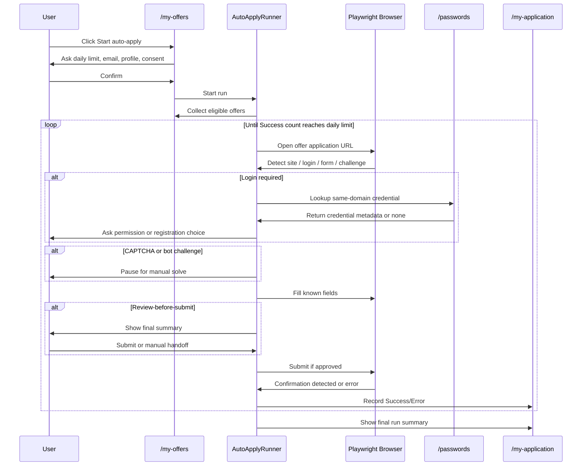

# Web Automation Tooling Decision + Job Auto-Apply Specification

**Audience:** JavaScript/TypeScript developers and Codex implementation agent  
**Date:** 2026-06-17  
**Primary goal:** automate user-approved job applications from `/my-offers` while keeping the workflow reliable, auditable, and compliant with third-party websites.

---

## 1. Tooling analysis: open-source browser automation

### 1.1 Decision summary

**Chosen library: Playwright for TypeScript.**

Playwright is the best quality/price option for this project because it is open source, free to use, TypeScript-friendly, cross-browser, actively maintained, and has strong reliability tooling such as auto-waiting, tracing, retries, browser contexts, and headed/headless execution.

### 1.2 Compared tools

| Tool | License/cost | Strengths | Weaknesses | Fit for this project |
|---|---:|---|---|---|
| **Playwright** | Apache-2.0 / $0 license cost | Chromium, Firefox, WebKit support; TypeScript-first; robust selectors; auto-waiting; tracing; browser contexts; good CI support | More browser binary weight than HTTP-only libraries | **Best fit** |
| **Puppeteer** | Apache-2.0 / $0 license cost | Simple Node API; excellent Chrome automation; now supports Firefox | Less broad than Playwright for WebKit and full cross-browser matrix | Good alternative, not primary |
| **Selenium WebDriver** | Apache-2.0 / $0 license cost | Long-standing standard; many languages; broad browser ecosystem | More setup and flakiness management; less ergonomic for modern JS flows | Good for legacy constraints |
| **Crawlee** | Apache-2.0 / $0 license cost | Queueing, retries, crawling framework; integrates Playwright/Puppeteer | More crawler-oriented; includes scale/proxy concepts that are not needed for user-supervised applications | Optional later, not core |

### 1.3 Recommendation

Use **Playwright** directly, not Crawlee, for the first version. Job applications are interactive, stateful, user-specific workflows; they need careful step-by-step control, human handoff, trace/debug artifacts, and safe credential handling more than large-scale crawling features.

Use **Crawlee only if** the product later needs queue orchestration across thousands of permitted internal URLs or approved partner sites. Do not use it to bypass website limits or anti-bot controls.

---

## 2. Codex task: install the selected library

### 2.1 Codex instruction

```md
You are Codex working inside this JavaScript/TypeScript repository.

Install Playwright as the browser automation engine.

Run:

npm install -D playwright @playwright/test
npx playwright install chromium

Then create the following folders if they do not already exist:

src/automation/
src/automation/strategies/
src/automation/security/
src/automation/ui-handoff/
src/automation/types/

Do not install stealth, fingerprint-spoofing, CAPTCHA-solver, or proxy-rotation packages.
The automation must run in a transparent, user-supervised, compliant mode.
```

### 2.2 Initial package scripts

Add these scripts to `package.json`:

```json
{
  "scripts": {
    "automation:test": "playwright test",
    "automation:headed": "playwright test --headed",
    "automation:report": "playwright show-report",
    "automation:install-browsers": "playwright install chromium"
  }
}
```

---

## 3. Safety, compliance, and anti-abuse boundaries

### 3.1 Allowed automation

The system may automate job applications only when:

1. The user owns or controls the account being used.
2. The application uses truthful user-provided profile data.
3. The target website allows, tolerates, or does not clearly prohibit this kind of user-side automation.
4. The workflow is rate-limited and user-approved.
5. The user can intervene at any point.

### 3.2 Disallowed automation

The system must not:

1. Bypass CAPTCHA, bot challenges, waiting rooms, access controls, or rate limits.
2. Use AI or third-party solvers to defeat CAPTCHA.
3. Spoof browser fingerprints, hide automation, or modify browser internals to evade detection.
4. Rotate IP addresses to evade website blocks.
5. Submit false, misleading, or fabricated application data.
6. Create accounts on behalf of the user without explicit user consent.
7. Continue against a website after repeated `403`, `429`, bot-challenge, account-lock, or policy-warning responses.

### 3.3 Proxy policy

Proxy support is allowed only for legitimate connectivity needs, for example:

- company network egress,
- user-configured privacy network,
- region-specific access when the user is physically or legally entitled to use that region.

Proxy support must not be used for IP rotation, ban evasion, CAPTCHA avoidance, or volume-based automation.

### 3.4 CAPTCHA policy

If CAPTCHA or a bot challenge appears:

1. Pause the automation.
2. Show the browser to the user.
3. Ask the user to solve it manually.
4. Continue only after the user confirms completion.
5. If the challenge cannot be solved by the user, mark the offer as `Error` with reason `CAPTCHA_OR_CHALLENGE_BLOCKED` and move it to the manual section.

---

## 4. Product scope

### 4.1 Pages

The product has three relevant pages:

1. `/my-offers`  
   Source page containing job offers to process.

2. `/passwords`  
   User-managed credentials page for previously used job-board or employer websites.

3. `/my-application`  
   Tracking page showing auto-applied and manual/error applications.

### 4.2 Main user story

As a job seeker, I want to choose how many applications I want to send today, select the email address to use, and let the system attempt applications from my saved job offers, while giving me control whenever a website needs manual input.

---

## 5. Functional requirements

### 5.1 Start from `/my-offers`

When the user clicks **Start auto-apply**, show a modal asking:

- `dailyApplicationLimit`: number of applications to attempt today.
- `emailAddress`: email address to use for registration and application.
- `applicationMode`: `review-before-submit` or `auto-submit-approved-sites-only`.
- `resumeProfile`: selected CV/resume/profile to use.
- `coverLetterMode`: `none`, `template`, or `ask-me`.
- `siteConsent`: confirmation that the user agrees to apply truthfully and comply with each website’s rules.

Validation:

- `dailyApplicationLimit` must be an integer between `1` and the configured product maximum.
- `emailAddress` must be verified by the user before use.
- The user must select a candidate profile before automation begins.

### 5.2 Offer collection

From `/my-offers`, collect every eligible offer with:

- offer ID,
- title,
- company,
- location,
- source website,
- application URL,
- current application status,
- date saved,
- tags or filters,
- user notes.

Skip offers that are already marked:

- `Applied`,
- `Withdrawn`,
- `Archived`,
- `Do not apply`,
- `Manual only`.

### 5.3 Daily limit

The automation must stop when:

- the number of `Success` applications reaches `dailyApplicationLimit`, or
- there are no more eligible offers, or
- the user clicks **Stop**, or
- the system detects repeated website blocks or account safety issues.

`Error` items do not count toward successful daily applications unless the user manually completes them and marks them as successful.

### 5.4 Browser session

Use Playwright Chromium in headed mode by default for auto-apply runs.

Requirements:

- One active browser context per user run.
- Concurrency default: `1`.
- Use persistent user session only with explicit user consent.
- Wait for elements to be visible/actionable instead of using fixed sleeps.
- Use accessibility-first selectors: role, label, placeholder, text, then CSS selectors as fallback.
- Capture safe traces only when debugging is enabled.
- Redact secrets and sensitive personal data from logs.

### 5.5 Website navigation

For each offer:

1. Open the application URL from the offer.
2. Detect whether the destination is:
   - an employer career site,
   - an ATS platform,
   - a job board,
   - a redirect chain,
   - an expired/deleted job,
   - a login/registration wall,
   - a manual-only form.
3. Use a matching strategy from `ATSStrategyRegistry` if available.
4. Otherwise use `GenericApplyStrategy`.
5. Fill only fields that can be mapped confidently from the user profile.
6. Ask the user before submitting unclear, optional, or legally sensitive fields.
7. Confirm final submission based on page text, URL change, confirmation component, or received confirmation event.

### 5.6 Registration/login flow

When a site requires an account:

1. Check whether credentials exist for the same root domain in `/passwords`.
2. If credentials exist, ask user permission to use them for this site.
3. If no credentials exist, ask whether to:
   - create a new account with the selected email,
   - use a different email,
   - skip this offer,
   - move to manual.
4. Generate a unique password by default when creating a new account.
5. Store the new credential only if the user explicitly agrees.
6. Never reuse a password from a different root domain automatically.
7. Never infer or derive credentials from other websites.

### 5.7 Password page behavior

`/passwords` must support:

- root-domain credential lookup,
- encrypted credential storage,
- credential labels,
- last-used date,
- created-by source,
- rotation reminder,
- manual delete,
- audit history.

A global fallback password is discouraged. If product stakeholders insist on supporting one, it must be opt-in, encrypted, clearly warned against, and never used without per-run user confirmation.

### 5.8 Form filling

Use a typed candidate profile model:

- identity,
- contact details,
- work authorization,
- resume/CV file,
- cover letter template,
- employment history,
- education,
- skills,
- salary expectations,
- availability,
- links,
- diversity questions, if the user explicitly opted in.

Rules:

- Required fields missing from the profile trigger a user prompt.
- Sensitive optional questions default to **skip** or **prefer not to say** when available.
- The system must not guess answers for legal, immigration, salary, disability, veteran, demographic, or background-check questions.
- File uploads must use user-approved documents only.

### 5.9 Final submit rule

Default mode is **review before submit**.

In this mode:

1. Fill application.
2. Stop at final submit button.
3. Show a summary of what will be submitted.
4. User clicks **Submit application** or **Move to manual**.

`auto-submit-approved-sites-only` may be enabled only for domains where:

- the user explicitly opted in,
- the strategy has passed tests,
- the website policy allows automation or there is no clear prohibition,
- all submitted answers come from confirmed profile data,
- no CAPTCHA/challenge is present.

---

## 6. Status model

### 6.1 Status values

Every processed offer must end with one of these statuses:

| Status | Meaning |
|---|---|
| `Success` | The system reached a confirmed application submission state. |
| `Error` | The automation did not reach a confirmed submission state. |

### 6.2 Error reasons

Use structured reasons for every `Error`:

- `EXPIRED_JOB`
- `LOGIN_REQUIRED_NO_CREDENTIALS`
- `REGISTRATION_REQUIRES_EMAIL_CONFIRMATION`
- `CAPTCHA_OR_CHALLENGE_BLOCKED`
- `WEBSITE_POLICY_BLOCKED`
- `RATE_LIMITED`
- `FORM_FIELD_UNMAPPED`
- `FILE_UPLOAD_FAILED`
- `FINAL_CONFIRMATION_NOT_DETECTED`
- `USER_STOPPED`
- `NETWORK_ERROR`
- `UNKNOWN_AUTOMATION_ERROR`

### 6.3 Manual section

A manual item is any offer that has `Error` and requires human completion.

Manual items must show:

- reason,
- last reached URL,
- last successful step,
- suggested next action,
- **Resume manually** button,
- **Mark as Success** button,
- **Retry automation** button if safe.

---

## 7. `/my-application` UI specification

The `/my-application` page must have two sections.

### 7.1 Section A: Auto-apply results

Display applications that were processed automatically.

Columns:

- status: `Success` or `Error`,
- job title,
- company,
- website,
- email used,
- submitted at / attempted at,
- strategy used,
- last step,
- trace/debug link if available,
- actions.

Actions:

- View details,
- Open job page,
- Retry if safe,
- Move to manual,
- Delete local trace.

### 7.2 Section B: Manual applications

Display offers that require manual intervention.

Columns:

- status: `Error` until the user manually marks it `Success`,
- job title,
- company,
- website,
- reason,
- last reached URL,
- next suggested action,
- actions.

Actions:

- Resume manually,
- Mark as Success,
- Skip permanently,
- Retry automation if the error reason is retryable.

---

## 8. Technical architecture

### 8.1 Modules

```txt
src/automation/
  AutoApplyRunner.ts
  OfferCollector.ts
  ApplicationPlanner.ts
  BrowserSessionManager.ts
  ApplicationRecorder.ts
  RateLimiter.ts
  ManualHandoffService.ts
  CaptchaHandoffService.ts
  Logger.ts

src/automation/strategies/
  ATSStrategy.ts
  ATSStrategyRegistry.ts
  GenericApplyStrategy.ts
  GreenhouseStrategy.ts
  LeverStrategy.ts
  WorkdayStrategy.ts
  SmartRecruitersStrategy.ts

src/automation/security/
  CredentialService.ts
  SecretVault.ts
  Redaction.ts
  ConsentService.ts

src/automation/types/
  Offer.ts
  CandidateProfile.ts
  ApplicationRun.ts
  ApplicationResult.ts
  StrategyResult.ts
```

### 8.2 Strategy pattern

Each website strategy implements:

```ts
export interface ATSStrategy {
  id: string;
  name: string;
  canHandle(input: StrategyInput): Promise<boolean>;
  prepare?(ctx: StrategyContext): Promise<void>;
  apply(ctx: StrategyContext): Promise<StrategyResult>;
  detectSuccess(ctx: StrategyContext): Promise<boolean>;
  detectBlockingIssue(ctx: StrategyContext): Promise<BlockingIssue | null>;
}
```

### 8.3 Core result type

```ts
export type ApplicationStatus = 'Success' | 'Error';

export interface ApplicationResult {
  offerId: string;
  status: ApplicationStatus;
  reason?: ErrorReason;
  website: string;
  finalUrl?: string;
  emailUsed: string;
  strategyId: string;
  startedAt: string;
  finishedAt: string;
  lastSuccessfulStep?: string;
  traceId?: string;
  requiresManualAction: boolean;
  userVisibleMessage: string;
}
```

### 8.4 Candidate profile type

```ts
export interface CandidateProfile {
  id: string;
  fullName: string;
  email: string;
  phone?: string;
  address?: {
    city?: string;
    region?: string;
    country?: string;
    postalCode?: string;
  };
  resumeFileId: string;
  coverLetterTemplateId?: string;
  links?: {
    linkedin?: string;
    github?: string;
    portfolio?: string;
  };
  workAuthorization?: Record<string, string>;
  education?: EducationEntry[];
  employmentHistory?: EmploymentEntry[];
  skills?: string[];
  salaryExpectations?: {
    amount?: number;
    currency?: string;
    period?: 'year' | 'month' | 'hour';
  };
  availability?: string;
  sensitiveQuestionPreferences?: {
    demographicQuestions: 'ask' | 'skip' | 'prefer-not-to-say';
    disabilityQuestions: 'ask' | 'skip' | 'prefer-not-to-say';
    veteranQuestions: 'ask' | 'skip' | 'prefer-not-to-say';
  };
}
```

---

## 9. Execution flow



---

## 10. Rate limiting and site-friendly behavior

The automation must be conservative:

- concurrency is `1` by default,
- no background mass-submission bursts,
- wait for page readiness and actionable controls,
- stop or back off on `429`, `403`, account warnings, or challenge pages,
- do not retry more than the configured safe retry count,
- do not continue a domain after repeated block signals,
- respect website policy warnings and terms shown during the session.

This is not “stealth” behavior. The goal is reliability and low load, not evasion.

---

## 11. Logging, traces, and privacy

### 11.1 Logging

Logs must include:

- run ID,
- offer ID,
- strategy ID,
- step names,
- status,
- structured error reason,
- timestamps,
- non-sensitive URLs.

Logs must not include:

- plaintext passwords,
- full resume content,
- full cover letter content,
- government IDs,
- sensitive demographic answers,
- session cookies,
- auth tokens.

### 11.2 Trace handling

Playwright traces are useful for debugging, but they can contain sensitive UI snapshots. Therefore:

- tracing defaults to off in production,
- user can enable tracing per run,
- traces expire automatically,
- traces are encrypted at rest if stored,
- traces can be deleted from `/my-application`,
- traces must be redacted or access-controlled.

---

## 12. Testing requirements

### 12.1 Unit tests

Cover:

- offer filtering,
- daily limit logic,
- credential lookup by root domain,
- status mapping,
- error reason mapping,
- redaction,
- strategy registry selection.

### 12.2 Integration tests

Use fixture websites that simulate:

- simple application form,
- login-required form,
- registration-required form,
- expired offer,
- file upload,
- CAPTCHA placeholder/manual handoff,
- final confirmation page,
- unmapped required field.

### 12.3 End-to-end tests

Run Playwright tests against local mock ATS pages.

Required E2E scenarios:

1. User sets daily limit to `3`; automation stops after `3` successful applications.
2. Missing required field triggers user handoff.
3. CAPTCHA placeholder pauses and creates manual item if not solved.
4. Expired job is marked `Error` with `EXPIRED_JOB`.
5. Successful application appears in `/my-application` auto-apply section.
6. Failed application appears in `/my-application` manual section.
7. Existing credential is used only after user confirmation.

---

## 13. Acceptance criteria

The implementation is accepted when:

1. Codex has installed Playwright and the project can run `npm run automation:test`.
2. `/my-offers` can start an auto-apply run with daily limit, email, profile, and consent.
3. The runner processes only eligible offers.
4. The runner stops when the daily success limit is reached.
5. Each processed offer ends as `Success` or `Error`.
6. `/my-application` shows auto-apply results and manual/error items in separate sections.
7. CAPTCHA and bot challenges pause for user action and are never bypassed automatically.
8. Credentials are stored securely and never logged in plaintext.
9. The system never installs or uses stealth, fingerprint-spoofing, CAPTCHA-solver, or IP-rotation packages.
10. Playwright traces are available for debugging only with appropriate redaction, access control, and retention.

---

## 14. Open implementation questions

1. Which ATS domains are officially allowed for automation?
2. Which candidate profile fields are mandatory for the first release?
3. Should `auto-submit-approved-sites-only` be available in v1, or should all final submissions require review?
4. What is the product-wide maximum daily application limit?
5. Should users be able to schedule runs, or only start them manually?
6. How long should application traces and logs be retained?
7. Which password vault or encryption provider should be used in production?

---

## 15. Recommended v1 scope

For v1, implement:

- Playwright Chromium headed mode,
- daily limit modal,
- email/profile selection,
- `/my-offers` collection,
- generic apply strategy,
- one or two tested ATS strategies,
- human review before final submit,
- CAPTCHA manual handoff,
- secure credential lookup for same-domain sites,
- `/my-application` auto/manual sections,
- structured logging and status reporting.

Defer:

- scheduled background runs,
- full ATS coverage,
- auto-submit without review,
- large-scale crawling,
- multi-browser execution,
- proxy support except explicit enterprise connectivity configuration.
